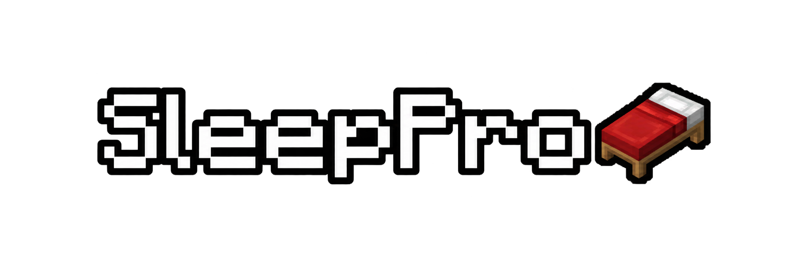

  

  <strong>A powerful multi-version server core for Minecraft: Bedrock Edition, written in PHP.</strong>

  
  
  
  

PUBLIC-сборка на основе NetherGamesMC/PocketMine-MP. Здесь только ребрендинг,
сетевые протоколы и палитры. Дополнительные механизмы, ИИ мобов и прочие
изменения партнёрской сборки не включены. PUBLIC не является ванильным сервером.

- API плагинов: `5.44.2`; пространства имён `pocketmine` сохранены для совместимости.
- Версия продукта: `0.1-PUBLIC`.
- Файл сборки: `SleepPro-0.1-PUBLIC.phar`.
- Основной конфиг: `settings.yml`.

Инструкции сборки находятся в [BUILDING.md](BUILDING.md).

Сетевая библиотека: `kostamax27/BedrockProtocol-NG`, commit `d29c470f71`;
палитры: `kostamax27/BedrockData-NG`, commit `81210858a5`.
Зависимости зафиксированы в `composer.lock`. Диапазон библиотеки: 1.20.0–1.26.45.
Проверены загрузка таблиц всех протоколов и запуск сервера, но не вход клиентов
каждой версии. Номер 2167 — внутренняя условная ступень сетевой библиотеки;
официальный протокол 1.26.40 — 2168, он также принимается.

Автопроверка обновлений исходного проекта отключена: она не обслуживает PUBLIC.
Старые авторские/технические ссылки в истории, лицензиях и зависимостях сохранены.

## Лицензия и происхождение

Основа: NetherGamesMC/PocketMine-MP, commit `d519b9051` (ветка stable).
Исходные авторские уведомления сохранены. Код основы: LGPL-3.0-or-later,
см. [LICENSE](LICENSE). Названия PocketMine-MP и NetherGamesMC в лицензиях,
истории и технических зависимостях указывают происхождение, а не название продукта.
Проект не связан с Mojang или Microsoft и не одобрен ими.
